class: inverse, center, middle, f36px, title

# Frankenstein's Monster  vs  Cthulhu!  <small>Imagining the Monster at the End of this World</small>

**Andrew Pilsch**  
**<small>Associate Professor of English</small>**  
**<small>@oncomouse</small>**  
**<small>he/him</small>**

.f44px[
**Materials: [http://atp1.us/frankenreads](http://atp1.us/frankenreads)**
]

**<small>Frankenreads ◊ Texas A&M ◊ November 15, 2018</small>**
---
class: inverse, center, middle
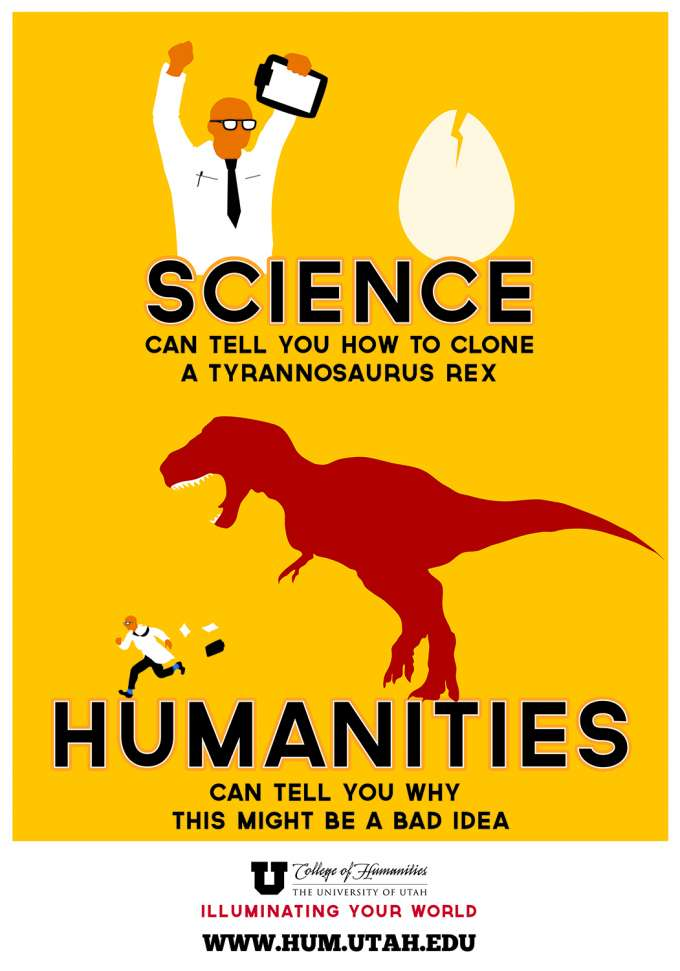
---
class: inverse, center, middle

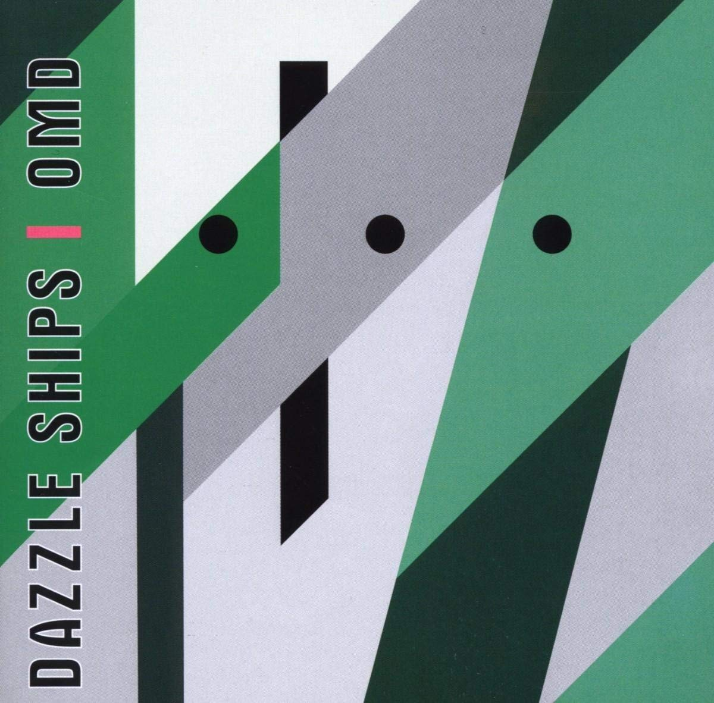
---
class: inverse, f40px

> Robotics a science  
> Tried in some factories  
> Functions and adaptability  
> Its own terminology  
> Auto industry production  
> Economic development  
> Engineering technology  
> Robotics a science  

---
class: center, middle, inverse
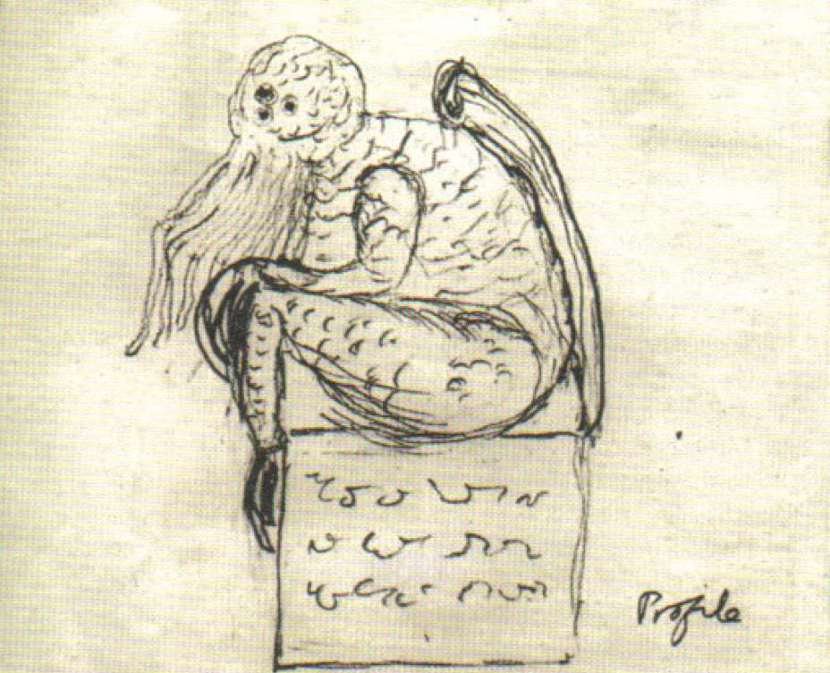
---
class: inverse, center, middle
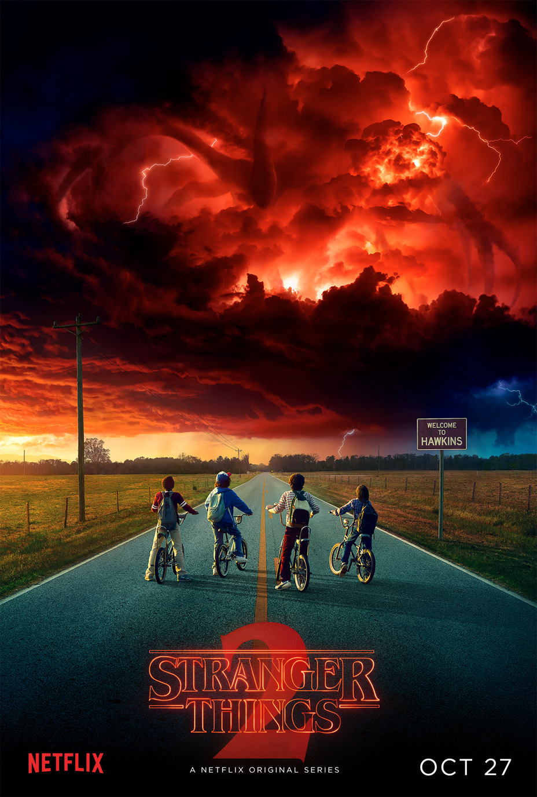
---
class: inverse, center, middle, lovecraft-books
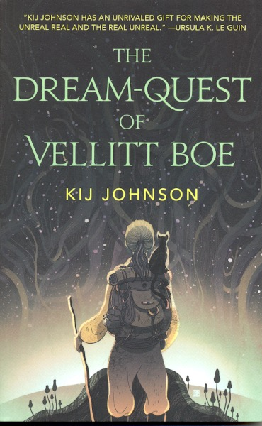
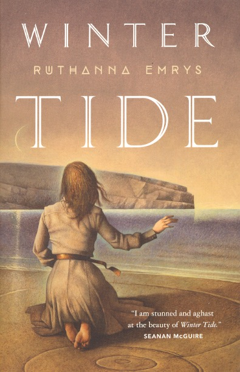
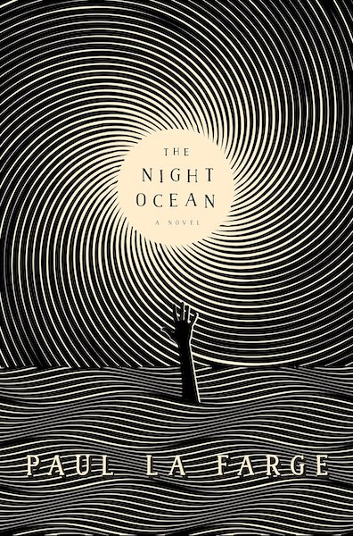
---
class: inverse, center, middle, lovecraft-philosophy

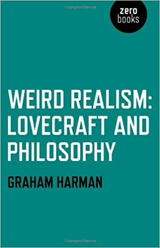
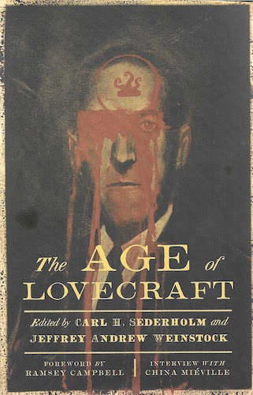
---
class: inverse, center, middle
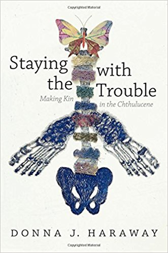
---
class: inverse, center, middle
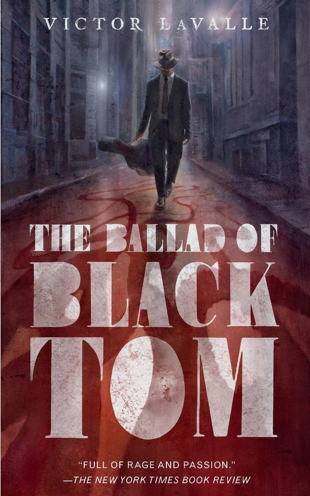
---
class: inverse, middle, f30px

> **"The seas will rise and our cities will be swallowed by the oceans," Black Tom said. "The air will grow so hot we won't be able to breathe. The world will be remade for Him, and His kind.** That white man was afraid of indifference; well, now he's going to find out what it's like.
>
> "I don't know how long it'll take. Our time and their time isn't counted the same. Maybe as month? Maybe a hundred years? All this will pass. Humanity will be washed away. The globe will be theirs again, and it's me who did it. Black Tom did it. I gave them the world. (148)
---
class: inverse, middle, f34px

> Hyperobjects are time-squished. To this extent H. P. Lovecraft’s monstrous god Cthulhu is a hyperobject, a giant squid-like being floating asleep in a non-Euclidean realm out there in the Universe. Our ecological devastation has summoned these Cthulhu-like hyperobjects to terrorize us. (84)
---
class: inverse, middle, center
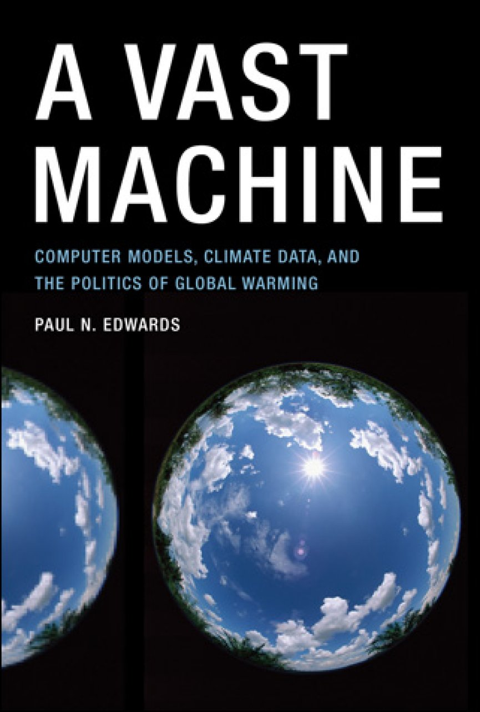
---
class: center, inverse, middle

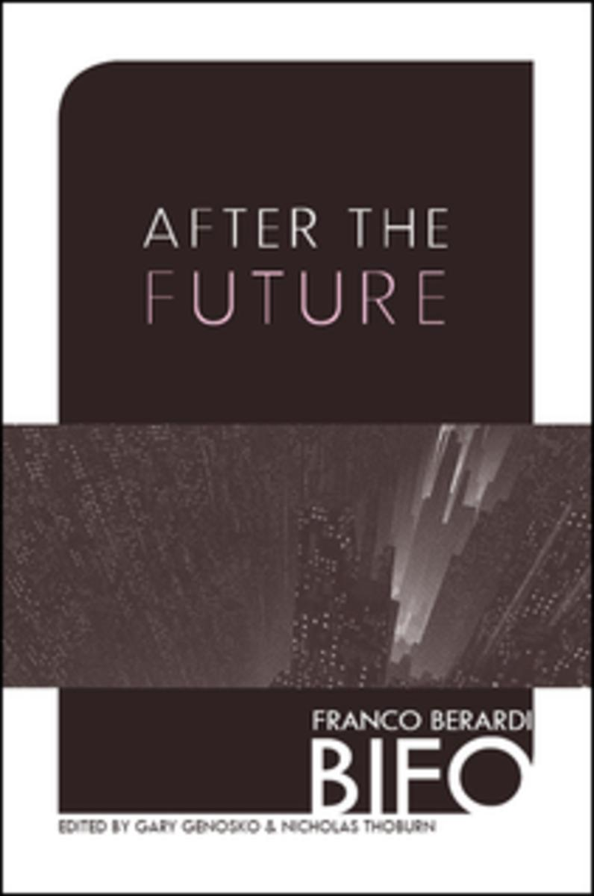
---
class: middle, inverse, f30px

> The most merciful thing in the world, I think, is the inability of the human mind to correlate all its contents. We live on a placid island of ignorance in the midst of black seas of infinity, and it was not meant that we should voyage far. **The sciences, each straining in its own direction, have hitherto harmed us little; but some day the piecing together of dissociated knowledge will open up such terrifying vistas of reality, and of our frightful position therein, that we shall either go mad from the revelation or flee from the deadly light into the peace and safety of a new dark age.** (167)
---
class: center, middle, inverse

---
class: pacific-rim, inverse, middle, f22px
background-image: url(../images/frankenreads/pacific-rim1.jpg)

> REPORTER: In the wake of the Sydney incident which showed the ineffective nature of the Wall of Life program, many are questioning the government's motives and wondering why the Jaeger program has been discontinued. Riots have erupted along the coastlines of several Pan Pacific cities.
>
> AMERICAN UN REP: We have now relocated millions of civilians and supplies 300 miles inland to the safe zones.
>
> WOMAN: Safe zones? For the rich and powerful? What about the rest of us?
>
> MAN: Yeah, answer the question.
>
> AMERICAN UN REP: I believe the Wall of Life is still our best option at this time. And that's all I'm gonna say on the matter. Thank you.

---
class: center, middle, f18px, inverse

<iframe frameborder="0" class="juxtapose" width="100%" height="560" src="https://cdn.knightlab.com/libs/juxtapose/latest/embed/index.html?uid=30494b3c-ddeb-11e8-9dba-0edaf8f81e27"></iframe>

image source: http://www.chinafile.com/infographics/submerged
---
class: pacific-rim, inverse, middle, f30px
background-image: url(../images/frankenreads/pacific-rim2.jpg)

> NEWT: And they've been here before in sort of a trial run. It was the dinosaurs. But the atmosphere wasn't conducive, right? So they waited it out. And they waited it out. And now with ozone depletion, and carbon monoxide, polluted waters well, we've practically terraformed it for them. Because now they're coming back, and it's perfect.

---
class: pacific-rim, inverse, middle, f30px
background-image: url(../images/frankenreads/pacific-rim3.jpg)

> Today, today at the edge of our hope at the end of our time we have chosen not only to believe in ourselves, but in each other. Today there's not a man nor woman in here that shall stand alone. Not today. Today we face the monsters that are at our door and bring the fight to them! Today we are canceling the apocalypse!
---
class: center, inverse, middle

# Thank You
