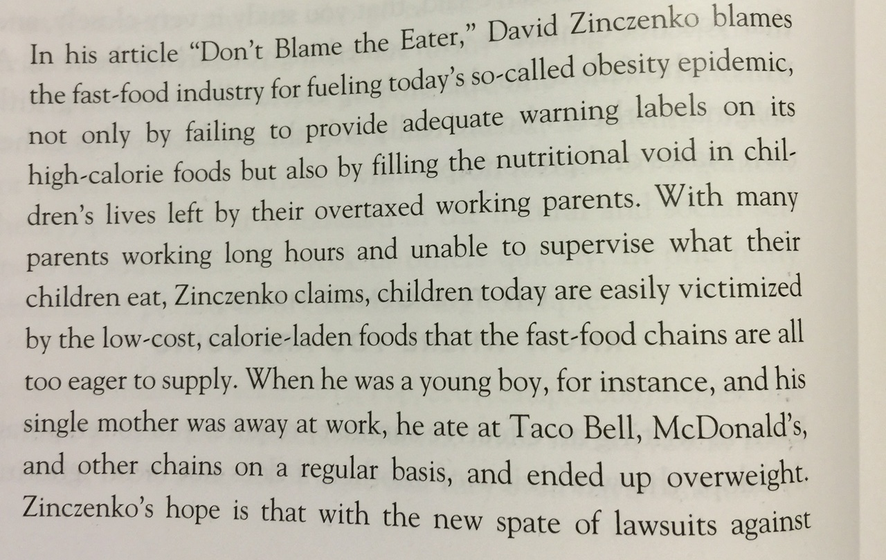

class: middle, center

.title-block[
# ENG101- Day 4

## Summarizing & Quoting
]
---
class: middle, bigger

.center[.title-block[
## Summarizing

###Be Fair ...
]]

> David Zinczenko's article, "Don't Blame the Eater," is nothing more than an angry rant in which he accuses the fast-food companies of an evil conspiracy to make people fat.

---

class: middle

.center[.title-block[

## Summarizing

### ... But Brief
]]

---
class: middle, center

## Signal Verbs on pg. 39-40

---
class: middle

.title-block[.center[

### Homework

## Share Your Position Summaries w/ Three Other Classmates

]]

---
class: middle, center
## Quoting

### Not just using templates to frame the quotes but ...

### Explain what the quote means

---
class: middle
## Example

> Today there are vast segments of the world population that will not concede it is better to be rich than poor, better to be bright than dull, better to be strong than weak, better to be free than regimented, or even that it is better to live than to die.

---
class: middle

## Better Example

> Today there are vast segments of the world population that will not concede it is better to be rich than poor, better to be bright than dull, better to be strong than weak, better to be free than regimented, or even that it is better to live than to die.

So what we see here is the moral imperative at the heart of transhumanism: why, if you didn't have to die, would you want to, they ask? This viewpoint, of course, ignores or is not bound to the idea that some people may be afraid of the drastic changes people like Ettinger are proposing.

---

class: center, middle, big

## [Do You Speak GIF?](https://medium.com/@mdvfunes/do-you-speak-gif-8e330e693e98)

[Unidentifiable Emojis Identified](http://www.buzzfeed.com/kaylabibeau/unidentifiable-emojis-identified-c21w)  
[25 Struggles All Students Know to Be True About the First Day Back From Break](http://www.buzzfeed.com/sofiana/25-struggles-all-students-know-to-be-true-about-th-18rks#.ki9apz1G)