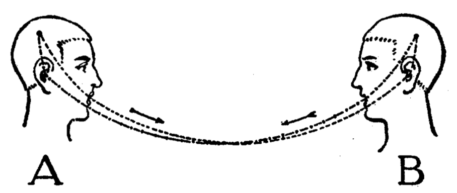
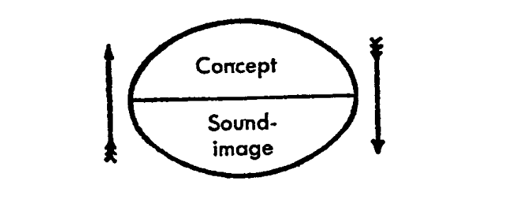

class: center, middle
# Ferdinand de Saussure, “Object of Linguistics” & “Nature of Linguistic Signs” from *Course in General Linguistics*
---
class: f26px
## The Problem of Language

> Other sciences work with objects that are given in advance and that can then be considered from different viewpoints; but not linguistics. Someone pronounces the French word nu `bare': a superficial observer would be tempted to call the word a concrete linguistic object; but a more careful examination would reveal successively three or four quite different things, depending on whether the word is considered as a sound, as the expression of an idea, as the equivalent of Latin nudum, etc. Far from it being the object that antedates the viewpoint, it would seem that it is the viewpoint that creates the object; besides, nothing tells us in advance that one way of considering the fact in question takes precedence over the others or is in any way superior to them. (8)
---
class: circuit, f23px
## Acts of Speaking

> Suppose that the opening of the circuit is in A's brain, where mental facts (concepts) are associated with representations of the linguistic sounds (sound-images) that are used for their expression. A given concept unlocks a corresponding sound-image in the brain; this purely *psychological* phenomenon is followed in turn by a *physiological* process: the brain transmits an impulse corresponding to the image to the organs used in producing sounds. Then the sound waves travel from the mouth of A to the ear of B: a purely *physical* process. Next, the circuit continues in B, but the order is reversed… (12)
---
class: f24px
## *Langue* and *Parole*

> How does the social crystallization of language come about? …
>
> … The nonpsychological part can be rejected from the outset. When we hear people speaking a language that we do not know, we perceive the sounds but remain outside the social fact because we do not understand them.
>
> Neither is the psychological part of the circuit wholly responsible: the executive side is missing, for execution is never-carried out by the collectivity. Execution is always individual, and the individual is always its master: *I shall call the executive side speaking* [*parole*]…
>
> … Language is not a function of the speaker; it is a product that is passively assimilated by the individual. (13-14)
---
class: f32px
## Characteristics

> To summarize, these are the characteristics of language:

1. Language is a well-defined object in the heterogeneous mass of speech facts.
1. Language, unlike speaking, is something that we can study separately.
1. Whereas speech is heterogeneous, language, as defined, is homogeneous.
1. Language is concrete, no less so than speaking; and this is a help in our study of it.
---
class: f25px
## Why This is a Big Deal

> We must call in a new type of facts in order to illuminate the special nature of language. Language is a system of signs that express ideas, and is therefore comparable to a system of writing, the alphabet of deaf-mutes, symbolic rites, polite formulas, military signals, etc. But it is the most important of all these systems.
>
> *A science that studies the life of signs within society is conceivable*; it would be a part of social psychology and consequently of general psychology; I shall call it *semiology* (from Greek *semefon* 'sign'). Semiology would show what constitutes signs, what laws govern them. Since the science does not yet exist, no one can say what it would be; but it has a right to existence, a place staked out in advance.  (15-16)
---
class: circuit, f22px
## Ways of Viewing Signs

> Some people regard language, when reduced to its elements, as a naming-process only-a list of words, each corresponding to the thing that it names. For example:

> This conception is open to criticism at several points. It assumes that ready-made ideas exist before words … ; it does not tell us whether a name is vocal or psychological in … ; finally, it lets us assume that the linking of a name and a thing is a very simple operation-an assumption that is anything but true. (65)
---
class: circuit, f30px
## Ways of Viewing Signs

> The linguistic sign unites, not a thing and a name, but a concept and a sound-image. The latter is not the material sound, a purely physical thing, but the psychological imprint of the sound, the impression that it makes on our senses. The sound-image is sensory… (66)

---
class: circuit, f27px
## Ways of Viewing Signs

> Our definition of the linguistic sign poses an important question of terminology. I call the combination of a concept and a sound- image a sign, but in current usage the term generally designates only a sound-image, a word, for example (arbor, etc.). One tends to forget that arbor is called a sign only because it carries the concept "tree," with the result that the idea of the sensory part implies the idea of the whole. (67)

---
class: f27px
## Arbitrary Nature of the Sign
> The bond between the signifier and the signified is arbitrary. Since I mean by sign the whole that results from the associating of the signifier with the signified, I can simply say: the linguistic sign is arbitrary…

> …The word arbitrary also calls for comment. The term should not imply that the choice of the signifier is left entirely to the speaker (we shall see below that the individual does not have the power to change a sign in any way once it has become established in the linguistic community) ; I mean that it is unmotivated, i.e. arbitrary in that it actually has no natural connection with the signified. (67-69)