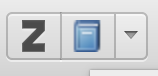

class: center, middle

# Modern Research Practices
---
class: bigger
## First: Pentads

1. Agent
1. Act
1. Agency
1. Purpose
1. Scene

* Dominant Term
---
class: middle, center

## Zotero!
### (aka The Greatest Thing EVER)
---
class: bigger

* Zotero is a tool that:
	* **Collects** sources
	* **Organizes** bibliographies
	* **Cites** references
	* **Syncs** across computers
	* **Collaborates** with other users
---
class: bigger
## How Do I Install This Wonderful Thing?

* Visit: [https://www.zotero.org/download/](https://www.zotero.org/download/)
	* If you are using Firefox, just install **Zotero for Firefox**!
	* If you are using Safari or Chrome, install **Zotero Standalone** and the browser extension!
	* If you are using Internet Explorer, why?
---
class: big
## In Firefox

1. Click:  
1. Click "Allow"   
1. Restart browser when it asks
---
class: big
## In Chrome/Safari

1. Click:   
1. Install the file that downloads (mount disk & drag app to `Applications` on a Mac; run .exe on Windows)
1. Click on "Chrome" (or "Safari"):   
1. In Chrome, you will be taken to the Google Web Store, click the "Add to Chrome" button in the upper right.
1. In Safari, it will download a file. Open it and when it asks click "Trust".
---
class: big,zotero4
## Getting Started w/ Zotero, 1

1. If using Chrome or Safari, start up the application you downloaded.
1. Go to: [https://www.zotero.org/user/register/](https://www.zotero.org/user/register/)
	* Remember your username and password!
1. Open Zotero Preferences:   
---
class: big, zotero5
## Getting Started w/ Zotero, 2

1. Click on the "Sync" Tab & Enter Your Username/Password:   
---
class: big, zotero5
## Getting Started w/ Zotero, 3
1. Click on the "Cite" Tab & Click "Install Microsoft Word Add-In" if you use Word:   
---
class: bigger
## Using Zotero, 1

1. In Zotero, click the "New Collection" button to start a collection (for a paper/class/etc):   
1. Name your collection:   
1. As long as you highlight that collection, Zotero will save sources to it.
---
class: bigger
## Using Zotero, 2

1. [Navigate to a book](https://www.amazon.com/Philosophy-Literary-Form-Kenneth-Burke/dp/0520024834/ref=sr_1_1?ie=UTF8&qid=1475505125&sr=8-1&keywords=the+philosophy+of+literary+form) you'd like to save on Amazon:   
1. In the Zotero menu, a blue book icon will appear:   
---
class: bigger
## Using Zotero, 3

1. This will appear, wait until it disappears (it can be slow):   
1. And the source will be in our collection!   
---
class: big

## Editing Sources in Zotero

.center[

]
---
class: bigger
## Other Sources

1. Zotero can grab sources from most academic databases!
	* JSTOR
	* ProjectMUSE
	* etc
1. Zotero can grab sources from:
	* Google Books
	* Many Newspapers
	* Many Magazines
1. Sometimes, you have to manually enter metadata
---
class: bigger
## But What Can I Do With This?

1. Right/Ctrl Click on a Collection and select "Create Bibliography From Collection" to generate a works cited page!
1. Use the Word plugin to add individual citations (formatted in MLA or Chicago or APA or anything else) and works cited, **automatically**.
---
class: bigger

## Why Citations Matter

1. Citations create a network of reference
	* They exist for future scholars to find where knowledge comes from
	* Who did they cite? Who else cited what they cited?
	* Thankfully, we can [automate this](https://scholar.google.com).
1. Incorrect citation breaks that network
---
class: bigger
## Accessing Scholarly Sources

1. On campus, automatically access scholarly databases:
	* Such as stuff from Google Scholar
1. Off campus, however, is another story. Two Options:
	1. The library proxy: Add `.lib-ezproxy.tamu.edu:2048` after the TLD (.org/.com/.net/.edu) of a database URL
	1. VPN: 
		* [Instructions for Mac](https://tamu.service-now.com/tamu-selfservice/knowledge_detail.do?sysparm_document_key=kb_knowledge,3b8f88b06f014e00b522db3bbb3ee4dd)
		* [Instructions for Windows](https://tamu.service-now.com/tamu-selfservice/knowledge_detail.do?sysparm_document_key=kb_knowledge,d46cc0706f014e00b522db3bbb3ee416)